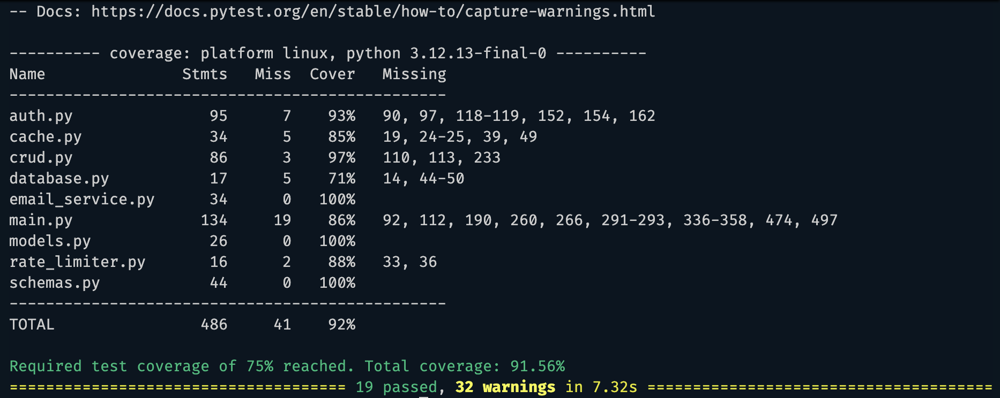

# goit-pythonweb-hw-012

REST API для контактів із JWT-авторизацією, верифікацією email, Redis-кешуванням
поточного користувача, reset password, ролями `user`/`admin`, тестами та
Sphinx-документацією.

## Запуск

```bash
cp .env.example .env
# заповніть SECRET_KEY, PostgreSQL, SMTP і Cloudinary-змінні
docker compose up --build
```

Документація API: `http://localhost:8000/docs`.

## Авторизація

Після логіну ви отримуєте пару токенів: `access_token` і `refresh_token`.
`access_token` використовується в заголовку авторизації, а `refresh_token` —
для отримання нової пари токенів через `/auth/refresh`.

```text
Authorization: Bearer <your_access_token>
```

## Основні маршрути

- `POST /auth/register` — реєстрація користувача.
- `POST /auth/login` — логін через OAuth2 form-data: `username=<email>`,
  `password=<password>`, повертає `access_token` і `refresh_token`.
- `POST /auth/refresh` — оновити пару токенів за чинним `refresh_token`.
- `POST /auth/logout` — відкликати поточний `refresh_token`.
- `GET /auth/verify/{token}` — підтвердження email.
- `POST /auth/request-email` — повторно надіслати email verification.
- `POST /auth/forgot-password` — надіслати інструкції для скидання пароля.
- `POST /auth/reset-password` — змінити пароль за reset token.
- `GET /users/me` — дані поточного користувача, кешуються через Redis.
- `PATCH /users/avatar` — оновлення аватара через Cloudinary, доступне тільки
  користувачу з роллю `admin`.
- `/contacts/` — CRUD контактів тільки для підтвердженого користувача.

## Redis cache

`get_current_user` спочатку шукає користувача в Redis за ключем `user:<email>`.
Якщо кеш порожній, користувач читається з БД і кешується на `USER_CACHE_TTL`
секунд. При підтвердженні email, зміні пароля, refresh-token сесії або аватара кеш інвалідовується.

## Тести

```bash
pytest
pytest --cov=auth --cov=cache --cov=crud --cov=database --cov=email_service --cov=main --cov=models --cov=rate_limiter --cov=schemas --cov-report=term-missing
```

У `pytest.ini` встановлено поріг покриття `75%`.

## Sphinx документація

```bash
sphinx-build -b html docs docs/_build/html
```

Відкрийте `docs/_build/html/index.html`.

## Змінні середовища

Усі конфіденційні налаштування зберігаються в `.env`. Приклад наведено у
`.env.example`.

## Test coverage


